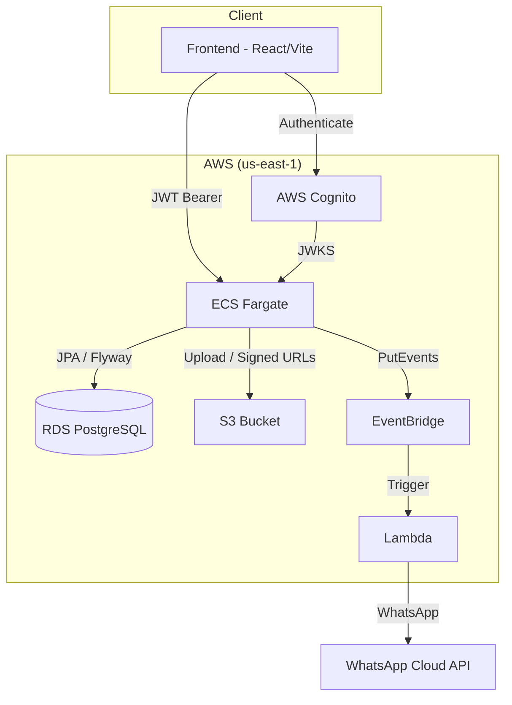
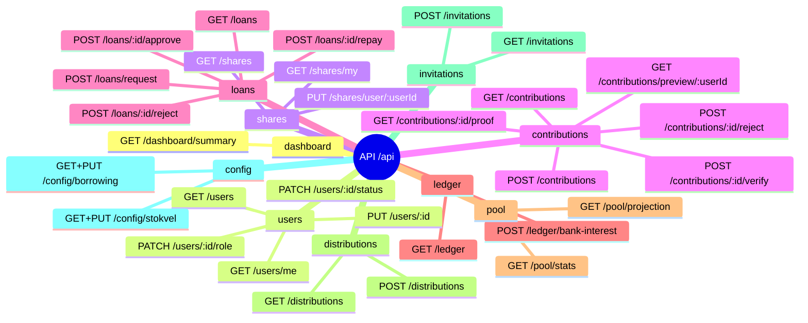

# Vault Vibes Backend

REST API for **Vault Vibes** - a digital platform for managing a stokvel (South African savings group). Handles member onboarding, monthly contributions, share valuation, borrowing, pool accounting, distributions, and WhatsApp notifications.

---


---

## Overview

Vault Vibes Backend is a stateless Spring Boot REST API that serves as the single source of truth for a stokvel's financial operations.

**Key features:**
- Invite-based member onboarding via AWS Cognito + WinSMS
- Monthly contribution tracking with proof-of-payment upload (S3)
- Share allocation and real-time valuation
- Short-term loan management with borrowing limits
- Immutable ledger-based pool accounting
- Year-end distribution projection
- WhatsApp notifications via EventBridge + Lambda

**Core formulas:**
```
Pool Value   = Bank Balance + Outstanding Loans
Share Value  = Pool Value ÷ Total Funded Shares
Member Value = Shares Owned × Share Value
Profit       = Member Value − Contributions Paid
```

All financial calculations are centralized in [`FinanceUtil.java`](src/main/java/com/vaultvibes/backend/util/FinanceUtil.java).

---

## Architecture



---

## Quick Start

### Prerequisites
- Java 21, Maven 3.9+, PostgreSQL 14+

### Setup
```bash
# Create the database
psql -c "CREATE DATABASE vaultvibes;"

# Run (Flyway applies migrations automatically)
./mvnw spring-boot:run
```

API starts on port 8080. Swagger UI: `http://localhost:8080/swagger-ui.html`

### Docker
```bash
docker build -t vault-vibes-api .
docker run -p 8080:8080 \
  -e SPRING_PROFILES_ACTIVE=local \
  -e DB_URL=jdbc:postgresql://host.docker.internal:5432/vaultvibes \
  vault-vibes-api
```

---

## API Endpoints

All `/api/**` endpoints require `Authorization: Bearer <cognito_jwt>`.



Full endpoint reference: [`docs/api.md`](docs/api.md)

---

## Project Structure

```
src/main/java/com/vaultvibes/backend/
├── auth/             # JWT resolution, permissions, role mapping
├── config/           # Security, CORS, Cognito, OpenAPI, S3, stokvel config
├── contributions/    # Monthly payments, proof upload, verification
├── dashboard/        # Personalized member dashboard
├── distributions/    # Year-end payouts
├── exception/        # Global error handling
├── health/           # Health check endpoint
├── invitations/      # Member onboarding, Cognito + WinSMS
├── ledger/           # Immutable transaction ledger
├── loans/            # Borrowing lifecycle
├── notifications/    # EventBridge event publishing
├── pool/             # Pool stats and year-end projection
├── shares/           # Share allocation and summary
├── users/            # User management, profile, Cognito linking
└── util/             # Centralized financial calculations (FinanceUtil)
```

---

## Configuration

| Variable | Required | Description |
|---|---|---|
| `DB_URL` | prod | JDBC connection URL |
| `DB_USERNAME` | prod | PostgreSQL username |
| `DB_PASSWORD` | prod | PostgreSQL password |
| `S3_BUCKET` | prod | S3 bucket for proof uploads |
| `WINSMS_API_KEY` | prod | WinSMS API key for SMS delivery |
| `WHATSAPP_PHONE_ID` | prod | WhatsApp Business phone ID |
| `WHATSAPP_TOKEN` | prod | Meta Cloud API bearer token |

Production secrets are stored in AWS Secrets Manager and injected into the ECS task definition at deploy time.

---

## Documentation

| File | Contents |
|---|---|
| [`docs/overview.md`](docs/overview.md) | What Vault Vibes is, core concepts, key formulas |
| [`docs/architecture.md`](docs/architecture.md) | AWS infrastructure, application layers, design decisions |
| [`docs/api.md`](docs/api.md) | Full endpoint reference with request/response examples |
| [`docs/calculations.md`](docs/calculations.md) | All financial formulas with diagrams |
| [`docs/flows.md`](docs/flows.md) | Mermaid diagrams for invite, auth, contribution, loan, and notification flows |
| [`docs/database.md`](docs/database.md) | Schema reference, ER diagram, indexes, Flyway usage |
| [`docs/development.md`](docs/development.md) | Local setup, Docker, CI/CD, adding new modules |
| [`docs/security.md`](docs/security.md) | Auth flow, JWT validation, role model, CORS, S3 access control |
