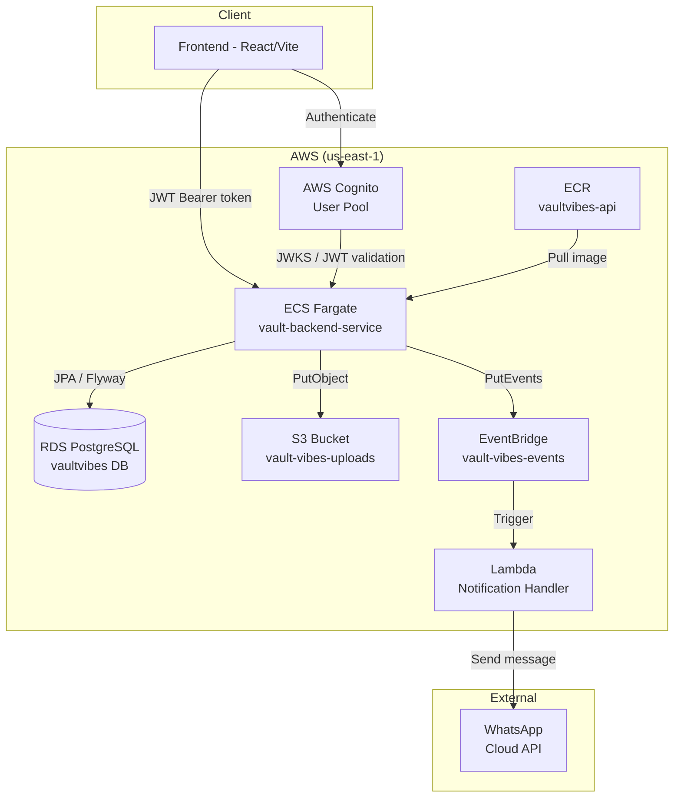
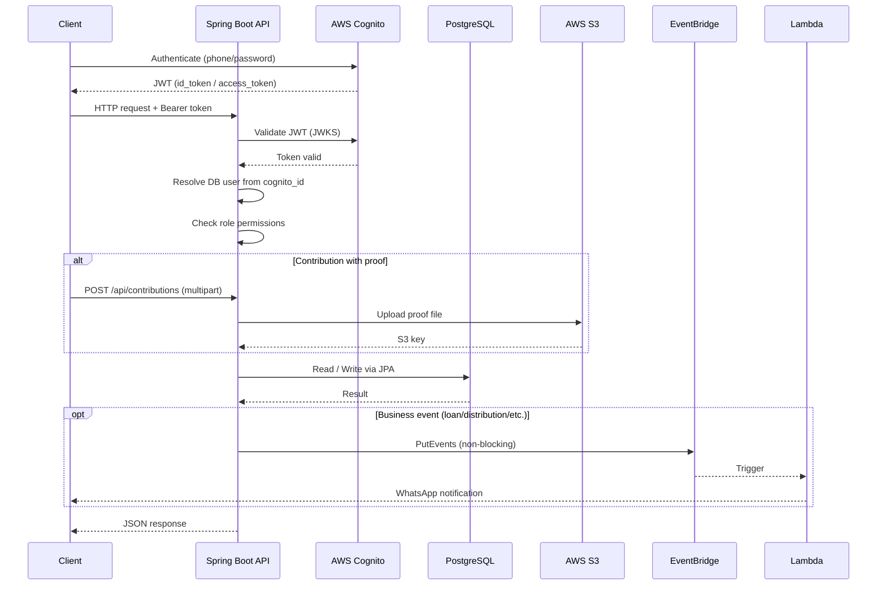
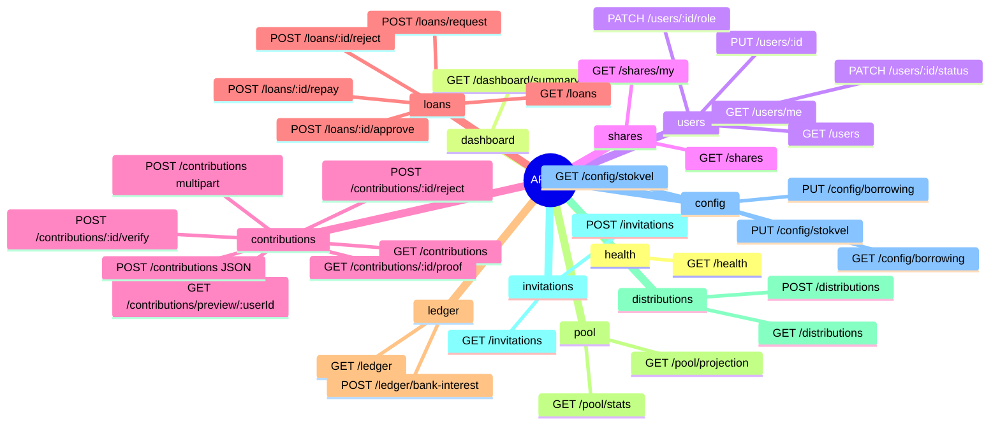
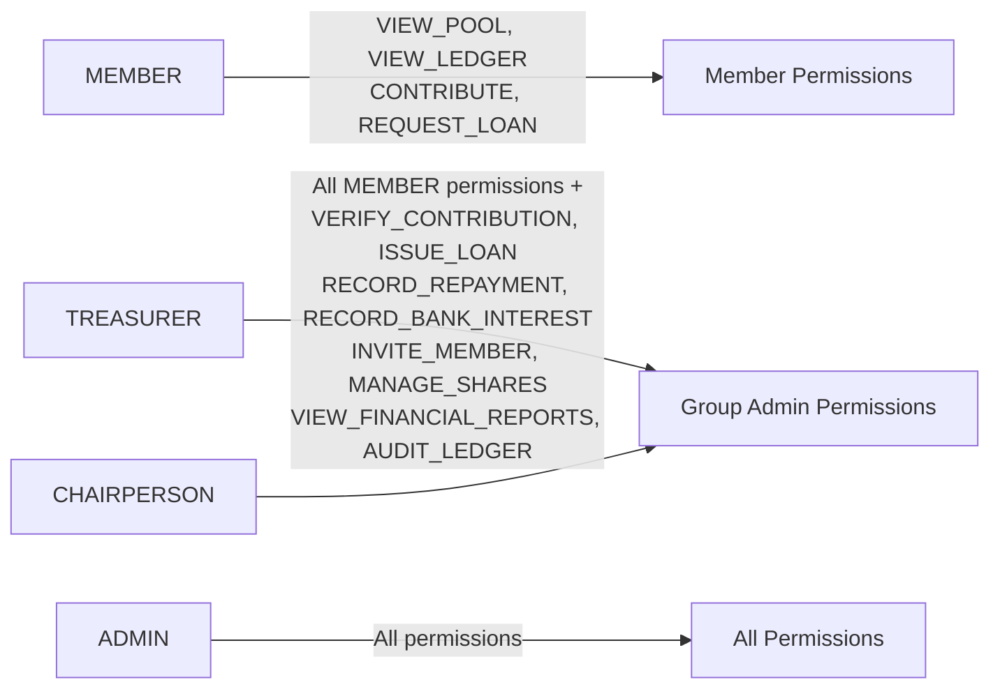
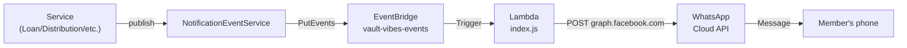
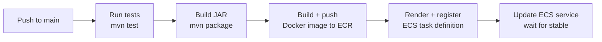

# Vault Vibes Backend

REST API for **Vault Vibes** — a digital platform for managing a stokvel (South African savings group). Handles member management, monthly contributions, share allocation, borrowing, distributions, pool accounting, and WhatsApp notifications.

---


> Replace `YOUR_ORG` in the build badge with your GitHub organisation or username.

---

## Overview

Vault Vibes Backend is a stateless Spring Boot REST API that serves as the single source of truth for a stokvel's financial operations. It exposes a secured JSON API consumed by the Vault Vibes frontend (React/Vite).

Key responsibilities:

- **Member lifecycle** — invitation, registration via AWS Cognito, role and status management.
- **Contributions** — members submit monthly payments with optional proof-of-payment (PDF/image) uploaded to S3; admins verify or reject them.
- **Shares** — tracks how many shares each member holds and at what price.
- **Borrowing** — members request loans; treasurers/chairpersons approve, reject, or mark repaid.
- **Ledger** — an immutable double-entry-style ledger is the authoritative source for all pool accounting.
- **Pool stats & projections** — real-time pool balance derived from the ledger, plus a year-end distribution projection.
- **Distributions** — records of payouts made to members.
- **Notifications** — key events (loan approved, distribution paid, etc.) are published to AWS EventBridge and delivered to members via WhatsApp through a Node.js Lambda function.

---

## Architecture Overview



---

## Request Flow



---

## Project Structure

```
vault-vibes-backend/
├── src/
│   ├── main/
│   │   ├── java/com/vaultvibes/backend/
│   │   │   ├── auth/             # JWT resolution, Permission enum, RolePermissions, PermissionService
│   │   │   ├── config/           # SecurityConfig, CorsConfig, CognitoConfig, OpenApiConfig,
│   │   │   │                     # StokvelConfig, BorrowingConfig, S3UploadService, ProofSignedUrlService
│   │   │   ├── contributions/    # ContributionEntity, ContributionService, ContributionController
│   │   │   ├── dashboard/        # DashboardService, DashboardController, DashboardSummaryDTO
│   │   │   ├── distributions/    # DistributionEntity, DistributionService, DistributionController
│   │   │   ├── exception/        # GlobalExceptionHandler, UserForbiddenException
│   │   │   ├── health/           # HealthController (/api/health)
│   │   │   ├── invitations/      # InvitationEntity, InvitationService, InvitationController
│   │   │   ├── ledger/           # LedgerEntryEntity, LedgerService, LedgerController
│   │   │   ├── loans/            # LoanEntity, LoanService, LoanController
│   │   │   ├── notifications/    # NotificationEventService, NotificationEventType,
│   │   │   │                     # NotificationProperties, NotificationEventDetail
│   │   │   ├── pool/             # PoolService, PoolProjectionService, PoolController
│   │   │   ├── shares/           # ShareEntity, ShareService, ShareController
│   │   │   ├── users/            # UserEntity, UserService, UserController, UserRepository
│   │   │   └── VaultVibesBackendApplication.java
│   │   └── resources/
│   │       ├── db/migration/
│   │       │   ├── V1__init_schema.sql   # Full schema DDL
│   │       │   └── V2__seed_data.sql     # Default stokvel and borrowing config
│   │       ├── application.yml           # Base config (all profiles)
│   │       ├── application-local.yml     # Local dev overrides
│   │       └── application-prod.yml      # Production overrides (reads env vars)
│   └── test/
│       ├── java/...VaultVibesBackendApplicationTests.java
│       └── resources/application-test.yml  # H2 in-memory DB for tests
├── lambda/
│   └── index.js                 # Node.js Lambda: EventBridge -> WhatsApp
├── .github/workflows/
│   └── deploy-prod.yml          # CI/CD: test -> build -> ECR -> ECS
├── Dockerfile                   # Multi-stage build (Maven + Eclipse Temurin JRE 21)
├── pom.xml
└── docs/                        # Deep-dive documentation (see Documentation section)
```

---

## Tech Stack

| Layer | Technology |
|---|---|
| Language | Java 21 |
| Framework | Spring Boot 3.3.8 |
| Security | Spring Security, OAuth2 Resource Server (JWT), AWS Cognito |
| Persistence | Spring Data JPA, Hibernate, PostgreSQL |
| Migrations | Flyway 10.22.0 |
| File storage | AWS S3 SDK v2 |
| Event bus | AWS EventBridge SDK v2 |
| Identity | AWS Cognito SDK v2 |
| Notifications | AWS Lambda (Node.js), WhatsApp Cloud API (Meta) |
| API docs | SpringDoc OpenAPI 2.5.0 (Swagger UI) |
| Build tool | Maven 3 |
| Container | Docker (Eclipse Temurin JRE 21) |
| CI/CD | GitHub Actions, AWS ECR, AWS ECS Fargate |
| Test database | H2 (in-memory, PostgreSQL mode) |

---

## Setup

### Prerequisites

- Java 21 (Temurin recommended)
- Maven 3.9+
- Docker (for containerised runs)
- PostgreSQL 14+ running locally **or** an AWS RDS instance
- AWS account with Cognito user pool, S3 bucket, and EventBridge configured (for full feature set)

### Local Database

```sql
-- Create the database (psql or any client)
CREATE DATABASE vaultvibes;
```

Flyway will apply `V1__init_schema.sql` and `V2__seed_data.sql` automatically on first run.

### Environment / Config

Copy or create `application-local.yml` (already present) and confirm the datasource URL matches your local PostgreSQL setup. See [Configuration](#configuration) for all properties.

---

## Running the Server

```bash
# Run with local profile (default)
./mvnw spring-boot:run

# Or explicitly
./mvnw spring-boot:run -Dspring-boot.run.profiles=local

# Package and run the JAR
./mvnw package -DskipTests
java -Dspring.profiles.active=local -jar target/vault-vibes-backend-0.0.1-SNAPSHOT.jar
```

The API starts on **port 8080**.

```bash
# Docker build and run (prod profile)
docker build -t vault-vibes-api .
docker run -p 8080:8080 \
  -e SPRING_PROFILES_ACTIVE=prod \
  -e DB_URL=jdbc:postgresql://... \
  -e DB_USERNAME=... \
  -e DB_PASSWORD=... \
  vault-vibes-api
```

---

## API Overview

All `/api/**` endpoints require a valid **AWS Cognito JWT** in the `Authorization: Bearer <token>` header.

Public endpoints (no auth required):

| Endpoint | Description |
|---|---|
| `GET /actuator/health` | Spring Boot health check |
| `GET /actuator/info` | Application info |
| `GET /swagger-ui.html` | Interactive API docs |
| `GET /v3/api-docs` | OpenAPI JSON spec |

Authenticated endpoints by domain:



Full endpoint details are in [`docs/api.md`](docs/api.md).

---

## Configuration

### Profile-based Config

| Profile | File | When used |
|---|---|---|
| `local` (default) | `application-local.yml` | Local development |
| `prod` | `application-prod.yml` | Production (ECS) |
| `test` | `application-test.yml` | Unit/integration tests (H2) |

### Key Properties

| Property / Env Var | Description | Default |
|---|---|---|
| `spring.datasource.url` / `DB_URL` | JDBC connection URL | `localhost:5432/vaultvibes` |
| `spring.datasource.username` / `DB_USERNAME` | DB username | `postgres` |
| `spring.datasource.password` / `DB_PASSWORD` | DB password | `postgres` |
| `cognito.user-pool-id` | AWS Cognito user pool ID | `us-east-1_Pmg4WjBdm` |
| `cognito.region` | AWS region for Cognito | `us-east-1` |
| `cognito.client-id` | Cognito app client ID | see `application.yml` |
| `aws.s3.bucket` / `S3_BUCKET` | S3 bucket for proof uploads | `vault-vibes-uploads` |
| `notifications.eventbridge.bus-name` | EventBridge bus name | `vault-vibes-events` |
| `notifications.whatsapp.phone-id` / `WHATSAPP_PHONE_ID` | WhatsApp Business phone ID | — |
| `notifications.whatsapp.token` / `WHATSAPP_TOKEN` | Meta Cloud API bearer token | — |

Production secrets (`DB_URL`, `DB_USERNAME`, `DB_PASSWORD`, `WHATSAPP_PHONE_ID`, `WHATSAPP_TOKEN`) are injected via AWS Secrets Manager into the ECS task at deploy time. See [`docs/development.md`](docs/development.md) for local setup guidance.

---

## Database

Schema is managed by **Flyway** and lives in `src/main/resources/db/migration/`:

| Migration | Description |
|---|---|
| `V1__init_schema.sql` | Creates all tables: `users`, `shares`, `contributions`, `loans`, `ledger_entries`, `distributions`, `invitations`, `stokvel_config`, `borrowing_config`, `pool_state` |
| `V2__seed_data.sql` | Seeds default stokvel config (20 shares @ R1,000) and borrowing config (20% interest rate) |

The **ledger_entries** table is the authoritative source for all pool accounting. Pool stats are derived by aggregating ledger entries at query time — no separate running totals are maintained.

Full schema documentation is in [`docs/database.md`](docs/database.md).

---

## Development

### Role Model



Permissions are checked in service/controller layer via `PermissionService.require(Permission)`. The role is read from the `users` table (not from Cognito groups) after the user is resolved from the Cognito `sub` claim.

### Notification Event Flow



Events: `LOAN_APPROVED`, `LOAN_ISSUED`, `CONTRIBUTION_OVERDUE`, `DISTRIBUTION_EXECUTED`, `MEMBER_INVITED`, `ROLE_UPDATED`.

Notification failures are logged but **do not roll back the originating business transaction**.

### Adding a New Domain Module

1. Create a package under `com.vaultvibes.backend/<domain>/`.
2. Add `Entity`, `Repository`, `Service`, `Controller`, and DTOs following the existing pattern.
3. Add a Flyway migration if new tables are needed.
4. Register any new `Permission` values in `Permission.java` and `RolePermissions.java`.

---

## Testing

```bash
# Run all tests
./mvnw test

# Run with coverage report
./mvnw verify
```

Tests use an **H2 in-memory database** (PostgreSQL compatibility mode) with Flyway disabled. The test profile is activated automatically by `src/test/resources/application-test.yml`.

---

## CI/CD

Pushes to `main` trigger the **Deploy Prod Backend** GitHub Actions workflow (`.github/workflows/deploy-prod.yml`):



AWS authentication uses **OIDC** (no long-lived credentials). Secrets are resolved from AWS Secrets Manager at deploy time.

---

## Documentation

Deeper technical documentation lives in `/docs`:

| File | Contents |
|---|---|
| [`docs/architecture.md`](docs/architecture.md) | Full AWS infrastructure diagram, component relationships, design decisions |
| [`docs/api.md`](docs/api.md) | All endpoints with request/response shapes, permission requirements, error codes |
| [`docs/database.md`](docs/database.md) | Full schema reference, entity relationships, indexing strategy, Flyway usage |
| [`docs/development.md`](docs/development.md) | Local setup, environment variables, running with Docker, adding features |
| [`docs/security.md`](docs/security.md) | Auth flow, JWT validation, role/permission model, S3 signed URLs, CORS policy |