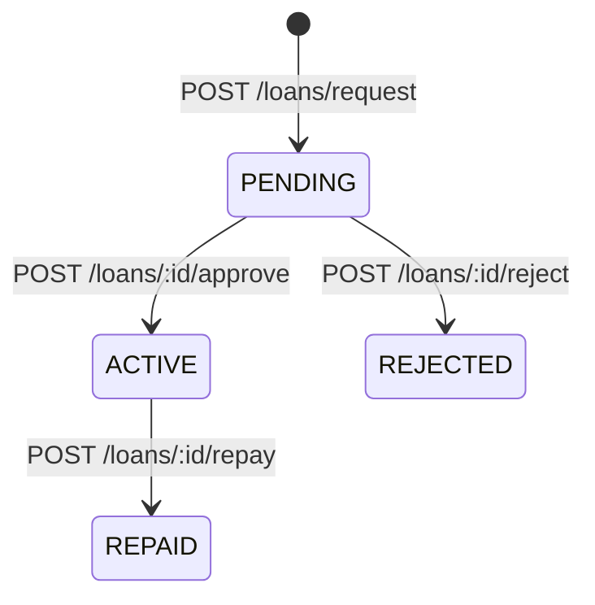

# API Reference

Base URL: `http://localhost:8080` (local) / `https://<your-domain>` (prod)

Interactive docs: `GET /swagger-ui.html`
OpenAPI spec:     `GET /v3/api-docs`

All `/api/**` endpoints require `Authorization: Bearer <cognito_jwt>`.

---

## Public Endpoints

| Method | Path | Description |
|---|---|---|
| GET | `/actuator/health` | Spring Boot health status |
| GET | `/actuator/info` | Application info |
| GET | `/api/health` | Custom health check → `{"status":"ok"}` |
| GET | `/swagger-ui.html` | Swagger UI |
| GET | `/v3/api-docs` | OpenAPI JSON |

---

## Health

### `GET /api/health`
Returns `{"status": "ok"}`. No authentication required.

---

## Dashboard

### `GET /api/dashboard/summary`
Returns a personalised summary for the authenticated user: their share count, contribution status, active loan, and high-level pool stats.

Permission: authenticated user (MEMBER+).

---

## Users

### `GET /api/users/me`
Returns the authenticated user's profile with share and contribution summary.

### `GET /api/users`
Lists all users with their share and contribution summaries.

### `PUT /api/users/{id}`
Updates a user's `fullName` and/or `email`.

Request body:
```json
{ "fullName": "Jane Doe", "email": "jane@example.com" }
```

### `PATCH /api/users/{id}/status`
Changes a user's status. Permission: `MANAGE_SHARES`.

Request body:
```json
{ "status": "ACTIVE" }
```
Valid values: `ACTIVE`, `SUSPENDED`, `PENDING`.

### `PATCH /api/users/{id}/role`
Changes a user's role. Permission: `MANAGE_SHARES`.

Request body:
```json
{ "role": "TREASURER" }
```
Valid values: `MEMBER`, `TREASURER`, `CHAIRPERSON`, `ADMIN`.

---

## Shares

### `GET /api/shares`
Returns aggregate share summary (total shares sold, price per unit, etc.).

### `GET /api/shares/my`
Returns the authenticated user's individual share records.

---

## Contributions

### `GET /api/contributions`
Lists all contributions across all members.

### `GET /api/contributions/preview/{userId}`
Returns the payment breakdown for a user's next contribution: contribution amount (shares × share price), active loan outstanding, and total due. Read-only — creates no records.

### `POST /api/contributions` (JSON, admin only)
Records a contribution without proof of payment. Contribution is auto-verified.

Permission: `VERIFY_CONTRIBUTION`.

Content-Type: `application/json`
```json
{
  "userId": "uuid",
  "contributionDate": "2025-03-01",
  "notes": "Cash payment"
}
```

### `POST /api/contributions` (multipart, member)
Records a contribution with an optional proof-of-payment file (PDF, JPG, JPEG, PNG — max 5 MB). Contributions with proof start in `PENDING` status.

Content-Type: `multipart/form-data`

| Field | Type | Required |
|---|---|---|
| `userId` | UUID | yes |
| `contributionDate` | date (ISO 8601) | yes |
| `notes` | string | no |
| `proofFile` | file | no |

### `GET /api/contributions/{id}/proof`
Returns a pre-signed S3 URL for the proof-of-payment file. URL expires after a configured number of minutes.

Access rules: a member may access their own proof; `VERIFY_CONTRIBUTION` is required to access another member's proof.

Response:
```json
{ "url": "https://s3.amazonaws.com/..." }
```

### `POST /api/contributions/{id}/verify`
Marks a contribution as `VERIFIED`. Permission: `VERIFY_CONTRIBUTION`.

### `POST /api/contributions/{id}/reject`
Marks a contribution as `REJECTED` with a mandatory reason. Permission: `VERIFY_CONTRIBUTION`.

Request body:
```json
{ "reason": "Proof image is illegible" }
```

Contribution statuses: `PENDING` → `VERIFIED` or `REJECTED`.

---

## Loans (Borrowing)



### `GET /api/loans`
Lists all loan records.

### `POST /api/loans/request`
Submits a new borrowing request for the authenticated user.

```json
{
  "principalAmount": 5000.00,
  "termMonths": 1
}
```

### `POST /api/loans/{id}/approve`
Approves a `PENDING` loan, transitions it to `ACTIVE`. Permission: `ISSUE_LOAN`.

### `POST /api/loans/{id}/reject`
Rejects a `PENDING` loan. Permission: `ISSUE_LOAN`.

### `POST /api/loans/{id}/repay`
Marks an `ACTIVE` loan as fully `REPAID`. Permission: `RECORD_REPAYMENT`.

---

## Ledger

### `GET /api/ledger`
Lists all ledger entries. The ledger is the authoritative record of all pool money movement.

### `POST /api/ledger/bank-interest`
Records bank interest earned by the pool. Creates a `BANK_INTEREST` ledger entry not tied to any member. Permission: `RECORD_BANK_INTEREST`.

```json
{
  "amount": 250.00,
  "description": "Interest for February 2025"
}
```

---

## Pool

### `GET /api/pool/stats`
Returns the current pool state derived from ledger aggregation:
- Total pool value (bank balance + outstanding loans)
- Capital committed (shares sold × price)
- Liquidity available
- Active borrowings count
- Outstanding loan balance
- Per-share value
- Share counts and price

### `GET /api/pool/projection`
Projects the pool value at year-end by adding expected contributions, loan interest, and an estimated bank interest (3-month historical average) to the current pool value.

---

## Distributions

### `GET /api/distributions`
Lists all distribution payout records.

### `POST /api/distributions`
Records a distribution payout for a member and fires a `DISTRIBUTION_EXECUTED` WhatsApp notification.

```json
{
  "userId": "uuid",
  "amount": 12000.00,
  "periodStart": "2025-01-01",
  "periodEnd": "2025-12-31"
}
```

---

## Invitations

### `GET /api/invitations`
Lists all invitations.

### `POST /api/invitations`
Creates a new member invitation and fires a `MEMBER_INVITED` notification. Permission: `INVITE_MEMBER`.

```json
{
  "phoneNumber": "+27821234567",
  "role": "MEMBER",
  "shareUnits": 1.0
}
```

Invitation statuses: `PENDING`, `ACCEPTED`.

---

## Config

### `GET /api/config/stokvel`
Returns the current stokvel configuration (total shares, share price).

### `PUT /api/config/stokvel`
Updates stokvel configuration. Permission: `MANAGE_SHARES`.

```json
{ "totalShares": 20, "sharePrice": 1000.00 }
```

### `GET /api/config/borrowing`
Returns the current borrowing configuration (interest rate).

### `PUT /api/config/borrowing`
Updates the borrowing interest rate. Permission: `MANAGE_SHARES`.

```json
{ "interestRate": 20.00 }
```

---

## Error Responses

| Status | When |
|---|---|
| `400 Bad Request` | Validation failure, business rule violation (e.g. duplicate contribution in same month) |
| `401 Unauthorized` | Missing or expired JWT |
| `403 Forbidden` | Authenticated but insufficient role/permission |
| `404 Not Found` | Resource does not exist |
| `500 Internal Server Error` | Unhandled server error |

Errors are handled centrally by `GlobalExceptionHandler` and return a consistent JSON body.
