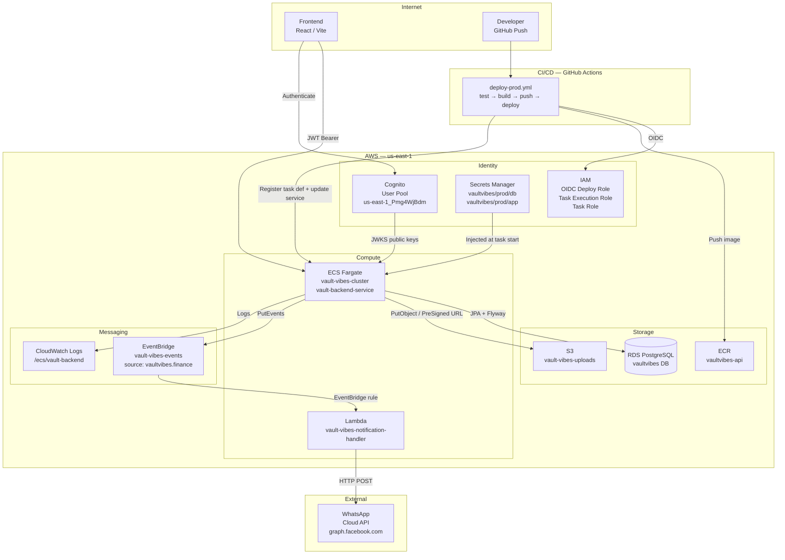
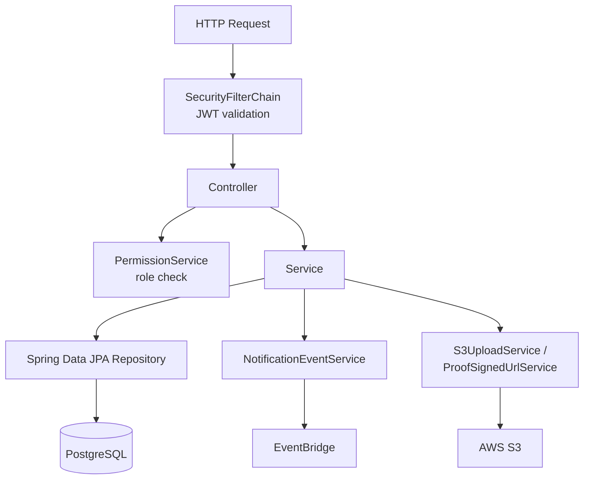

# Architecture

## AWS Infrastructure

## Application Layer

## Design Decisions

### Ledger as source of truth
All pool money movement is recorded in `ledger_entries`. Pool stats (balance, liquidity, per-share value) are computed by aggregating ledger entries at query time. This makes the ledger auditable and prevents silent state drift.

### Stateless API
No HTTP sessions. Every request is authenticated via a short-lived Cognito JWT. The ECS service can scale horizontally without session affinity.

### Non-fatal notifications
`NotificationEventService` catches all EventBridge exceptions and logs them. A failed WhatsApp notification will never roll back a financial transaction.

### Role resolved from the database
After JWT validation extracts the Cognito `sub`, the API looks up the corresponding `users` row to get the current role. This means roles can be changed without re-issuing JWTs.

### Flyway for schema management
All DDL is version-controlled in `src/main/resources/db/migration/`. `ddl-auto: none` ensures Hibernate never modifies the schema.
