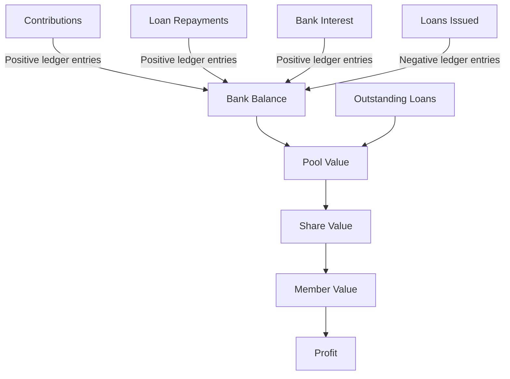
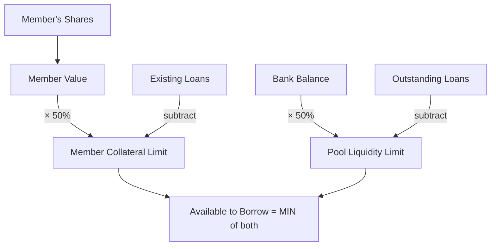

# Financial Calculations

All financial formulas are centralized in `FinanceUtil.java`. No controller or service should implement these calculations directly.

## Pool Valuation



### Pool Value

The total value of the stokvel, including both liquid cash and money lent out.

```
Pool Value = Bank Balance + Outstanding Loans
```

- Bank Balance = SUM of all signed ledger entries (contributions add, loan disbursements subtract)
- Outstanding Loans = SUM of (principal − amount_repaid) for all active loans

### Share Value

What one share is currently worth. Fluctuates as the pool grows.

```
Share Value = Pool Value ÷ Total Funded Shares
```

If no shares have been sold yet, falls back to the configured share price.

### Member Value

What a member's stake is worth right now.

```
Member Value = Shares Owned × Share Value
```

### Profit

How much a member has gained (or lost) relative to what they've paid in.

```
Profit = Member Value − Contributions Paid
```

## Interest

Flat simple interest on loans. Not compounded.

```
Interest = Principal × (Rate ÷ 100)
```

Default rate: 20% (configurable via `/api/config/borrowing`).

## Contribution Amount

How much a member pays each month. Determined by their share count.

```
Contribution Amount = Share Units × Share Price
```

## Borrowing Limits

Two constraints determine how much a member can borrow:



1. Member collateral rule: can borrow up to 50% of their share value, minus any outstanding loans
2. Pool liquidity rule: the stokvel must retain at least 50% of its cash balance

```
Member Limit = (Member Value × 0.50) − User's Outstanding Loans
Pool Limit   = (Bank Balance × 0.50) − Total Outstanding Loans
Available    = MIN(Member Limit, Pool Limit)
```

## Year-End Projection

Estimates the pool value at distribution time by extrapolating current trends.

```
Projected Pool = Current Pool
               + (Monthly Contributions × Months Remaining)
               + Expected Loan Interest
               + (Avg Monthly Bank Interest × Months Remaining)
```

Bank interest is estimated from a 3-month rolling average of `BANK_INTEREST` ledger entries.
