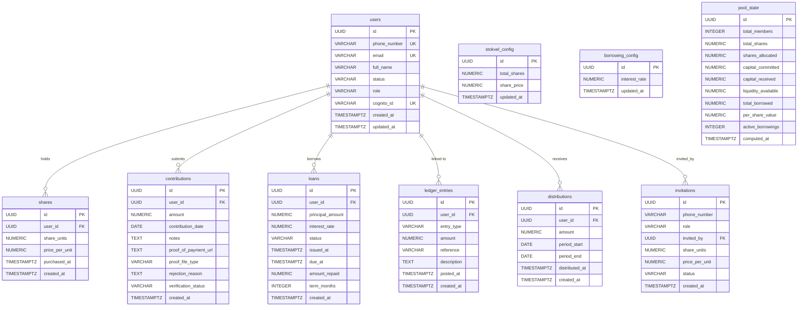

# Database

## Overview

- **Engine**: PostgreSQL 14+ (prod: AWS RDS)
- **Schema management**: Flyway (migrations in `src/main/resources/db/migration/`)
- **ORM**: Hibernate via Spring Data JPA (`ddl-auto: none`)
- **Extension**: `pgcrypto` (for `gen_random_uuid()`)

---

## Entity Relationship Diagram



---

## Table Reference

### `users`
Stores all registered members. `cognito_id` links to the AWS Cognito user pool sub. `role` drives permission checks in the application layer.

| Column | Type | Notes |
|---|---|---|
| `id` | UUID | Primary key |
| `phone_number` | VARCHAR(25) | Unique, used to resolve invitations |
| `email` | VARCHAR(255) | Optional, unique |
| `full_name` | VARCHAR(255) | Required |
| `status` | VARCHAR(40) | `PENDING`, `ACTIVE`, `SUSPENDED` |
| `role` | VARCHAR(40) | `MEMBER`, `TREASURER`, `CHAIRPERSON`, `ADMIN` |
| `cognito_id` | VARCHAR(255) | AWS Cognito sub; indexed |

### `shares`
Each row represents a share purchase event for a member. A member's total share count is the sum of all their `share_units` rows.

### `contributions`
Monthly payment records. `verification_status` is `PENDING`, `VERIFIED`, or `REJECTED`. `proof_of_payment_url` stores the S3 object key (not a public URL). A unique partial index (`uq_contributions_user_month`) prevents more than one non-rejected contribution per member per calendar month.

### `loans`
Loan lifecycle: `PENDING` → `ACTIVE` → `REPAID` (or `REJECTED`). `amount_repaid` tracks partial repayments; the full repayment path sets status to `REPAID`.

### `ledger_entries`
**Source of truth for all pool accounting.** Every inflow and outflow is recorded here. `entry_type` includes values such as `CONTRIBUTION`, `LOAN_DISBURSEMENT`, `LOAN_REPAYMENT`, `BANK_INTEREST`, `DISTRIBUTION`. Pool stats are computed by aggregating this table.

### `distributions`
Records of cash payouts made to members at the end of a period.

### `invitations`
Pre-registers a phone number with a role and share allocation before the user signs up. Status: `PENDING`, `ACCEPTED`.

### `stokvel_config`
Single-row configuration table. Holds the group's total authorised share count and current share price.

### `borrowing_config`
Single-row configuration. Holds the current loan interest rate (default 20%).

### `pool_state`
Snapshot table for materialised pool state. Not currently used by the live API (stats are computed directly from the ledger), but available for historical snapshots.

---

## Indexes

| Table | Index | Columns |
|---|---|---|
| `users` | `idx_users_cognito_id` | `cognito_id` |
| `shares` | `idx_shares_user_id` | `user_id` |
| `contributions` | `idx_contributions_user_id` | `user_id` |
| `contributions` | `uq_contributions_user_month` | `(user_id, contribution_year_month(contribution_date))` where `verification_status <> 'REJECTED'` |
| `loans` | `idx_loans_user_id` | `user_id` |
| `ledger_entries` | `idx_ledger_entries_user_id` | `user_id` |
| `ledger_entries` | `idx_ledger_entries_posted_at` | `posted_at` |
| `ledger_entries` | `idx_ledger_entries_type` | `entry_type` |
| `distributions` | `idx_distributions_user_id` | `user_id` |
| `invitations` | `idx_invitations_phone_number` | `phone_number` |
| `invitations` | `idx_invitations_status` | `status` |

---

## Flyway

Migrations are applied automatically on startup.

```
src/main/resources/db/migration/
├── V1__init_schema.sql   — Full schema DDL (all tables, indexes, function)
└── V2__seed_data.sql     — Default stokvel config and borrowing config rows
```

**Never edit an existing migration.** Add a new numbered file (`V3__...sql`) for any schema change.

Flyway is disabled in the test profile (`application-test.yml`); the test suite uses H2 DDL-auto instead.
