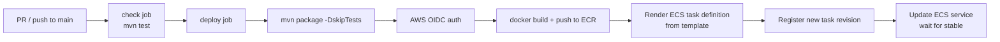

# Development Guide

## Prerequisites

| Tool | Version |
|---|---|
| Java (Temurin recommended) | 21 |
| Maven | 3.9+ |
| PostgreSQL | 14+ |
| Docker | 24+ (optional) |
| AWS CLI | v2 (optional, for cloud features) |

---

## Local Setup

### 1. Clone and configure

```bash
git clone <repo-url>
cd vault-vibes-backend
```

The default Spring profile is `local`. The local datasource config is in `src/main/resources/application-local.yml`:

```yaml
spring:
  datasource:
    url: jdbc:postgresql://localhost:5432/vaultvibes
    username: postgres
    password: postgres
```

Adjust these to match your local PostgreSQL instance.

### 2. Create the database

```sql
CREATE DATABASE vaultvibes;
```

Flyway will apply `V1__init_schema.sql` and `V2__seed_data.sql` automatically on the first run.

### 3. AWS credentials (optional for local dev)

Most API endpoints work without AWS connectivity. However, the following features require AWS credentials in your environment:

| Feature | AWS Service |
|---|---|
| Proof-of-payment upload | S3 |
| Proof signed URL generation | S3 |
| WhatsApp notifications | EventBridge |
| User lookup by Cognito ID | Cognito |

For local development, configure credentials via `~/.aws/credentials` or environment variables (`AWS_ACCESS_KEY_ID`, `AWS_SECRET_ACCESS_KEY`, `AWS_DEFAULT_REGION`).

### 4. Run the server

```bash
./mvnw spring-boot:run
```

API starts on **port 8080**. Swagger UI: `http://localhost:8080/swagger-ui.html`.

---

## Environment Variables

These are the variables the production container expects. For local dev, the `application-local.yml` hardcodes sensible defaults, so you only need to set the ones relevant to features you are testing.

| Variable | Required in prod | Description |
|---|---|---|
| `DB_URL` | yes | JDBC URL, e.g. `jdbc:postgresql://host:5432/vaultvibes` |
| `DB_USERNAME` | yes | PostgreSQL username |
| `DB_PASSWORD` | yes | PostgreSQL password |
| `S3_BUCKET` | yes | S3 bucket name for proof-of-payment uploads |
| `WHATSAPP_PHONE_ID` | yes | WhatsApp Business phone number ID |
| `WHATSAPP_TOKEN` | yes | Meta Cloud API bearer token |

Production secrets are stored in AWS Secrets Manager (`vaultvibes/prod/db` and `vaultvibes/prod/app`) and injected into the ECS task definition at deploy time.

---

## Docker

### Build and run locally

```bash
docker build -t vault-vibes-api .
docker run -p 8080:8080 \
  -e SPRING_PROFILES_ACTIVE=local \
  -e DB_URL=jdbc:postgresql://host.docker.internal:5432/vaultvibes \
  -e DB_USERNAME=postgres \
  -e DB_PASSWORD=postgres \
  vault-vibes-api
```

The `Dockerfile` uses a multi-stage build:
1. **Build stage** — Maven on Eclipse Temurin 21 compiles and packages the JAR.
2. **Runtime stage** — Eclipse Temurin JRE 21 runs the JAR with `spring.profiles.active=prod`.

---

## CI/CD Pipeline



The workflow is in `.github/workflows/deploy-prod.yml`. It runs on every push to `main` and can also be triggered manually (`workflow_dispatch`).

### Required GitHub Secrets

| Secret | Description |
|---|---|
| `AWS_GITHUB_DEPLOY_ROLE_ARN` | IAM role ARN assumed via OIDC for the deploy |
| `ECS_TASK_EXECUTION_ROLE_ARN` | ECS task execution role ARN (optional if already in current task def) |
| `ECS_TASK_ROLE_ARN` | ECS task role ARN (optional if already in current task def) |

---

## Adding a Database Migration

1. Create a new file in `src/main/resources/db/migration/` following the naming convention: `V{next_number}__{description}.sql`.
2. Write the DDL. Never modify an existing migration file.
3. Test locally — Flyway will apply the migration on next startup.

---

## Adding a New Domain Module

Follow the existing package structure:

```
com.vaultvibes.backend.<domain>/
├── <Domain>Entity.java         — JPA entity
├── <Domain>Repository.java     — Spring Data repository
├── <Domain>Service.java        — Business logic
├── <Domain>Controller.java     — REST controller (@RequestMapping("/api/<domain>"))
└── dto/
    ├── <Domain>DTO.java
    └── <Domain>RequestDTO.java
```

If the module introduces new permission checks:
1. Add the permission to `Permission.java`.
2. Add it to the appropriate role set in `RolePermissions.java`.

---

## CORS

CORS is configured in `CorsConfig.java`. Allowed origins for local development:

- `http://localhost:5173` (Vite dev server)
- `http://localhost:3000`

For production, update `CorsConfig` to allow the deployed frontend origin.

---

## Logs

Local logs output to console. In production, logs are written to CloudWatch Logs under the log group `/ecs/vault-backend`.
