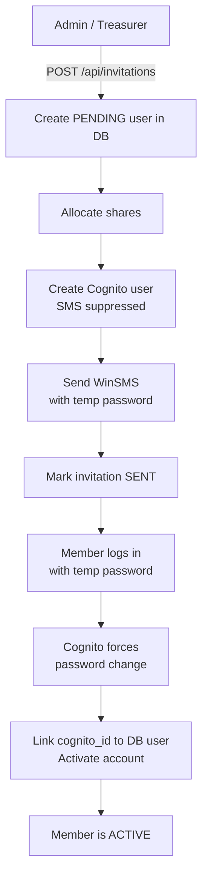
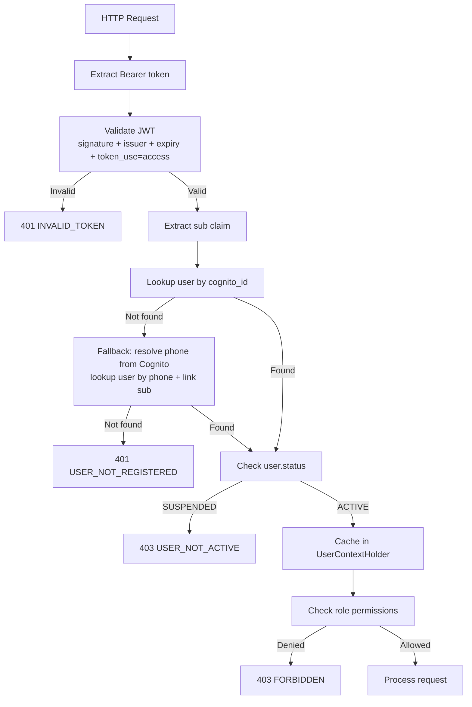
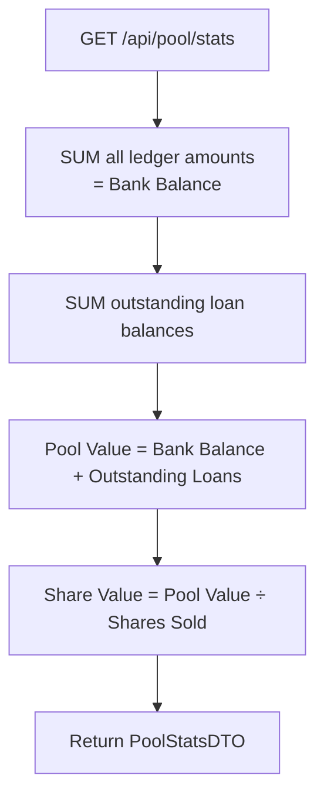
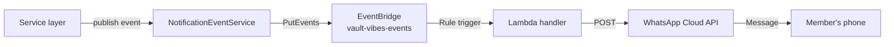

# Workflow Flows

Visual guides for the main backend workflows.

## Invite Flow

How a new member joins the stokvel.



## Authentication Flow

Every authenticated API request goes through this pipeline.



## Contribution Flow

Monthly payment submission and verification.

```mermaid
flowchart TD
    Member[Member] -->|POST /api/contributions\nmultipart with proof| UploadProof[Upload proof to S3]
    UploadProof --> RecordContribution[Record contribution\nstatus = PENDING]
    RecordContribution --> AdminReview[Admin reviews proof]
    AdminReview -->|POST /{id}/verify| Verify[Mark VERIFIED\nPost ledger entry]
    AdminReview -->|POST /{id}/reject| Reject[Mark REJECTED\nwith reason]

    Admin[Admin] -->|POST /api/contributions\nJSON, no proof| AutoVerify[Record contribution\nstatus = VERIFIED\nPost ledger entry]

    Verify --> CheckLoan{Active loan?}
    AutoVerify --> CheckLoan
    CheckLoan -->|Yes| RepayLoan[Settle loan repayment\nPost repayment ledger entry]
    CheckLoan -->|No| Done[Done]
    RepayLoan --> Done
```

## Loan Flow

Borrowing lifecycle from request to repayment.

```mermaid
flowchart TD
    Member[Member] -->|POST /api/loans/request| ValidateEligibility[Validate:\n- Account active\n- Owns shares\n- Within borrow limit\n- No cross-month loan]
    ValidateEligibility -->|Fail| RejectRequest[400 Bad Request]
    ValidateEligibility -->|Pass| CreateLoan[Create loan\nstatus = PENDING]
    CreateLoan --> AdminAction[Admin reviews]
    AdminAction -->|POST /{id}/approve| Approve[Status → ACTIVE\nNegative ledger entry\nNotify member]
    AdminAction -->|POST /{id}/reject| RejectLoan[Status → REJECTED]
    Approve --> Repayment[Repayment via\nnext contribution]
    Repayment --> FullyRepaid[Status → REPAID\nPositive ledger entry]
```

## Pool Valuation Flow

How pool stats are computed on every request.



## Notification Flow

How business events reach members via WhatsApp.



Events: `LOAN_APPROVED`, `LOAN_ISSUED`, `CONTRIBUTION_OVERDUE`, `DISTRIBUTION_EXECUTED`, `MEMBER_INVITED`, `ROLE_UPDATED`.

Notification failures are logged but never roll back the originating business transaction.
