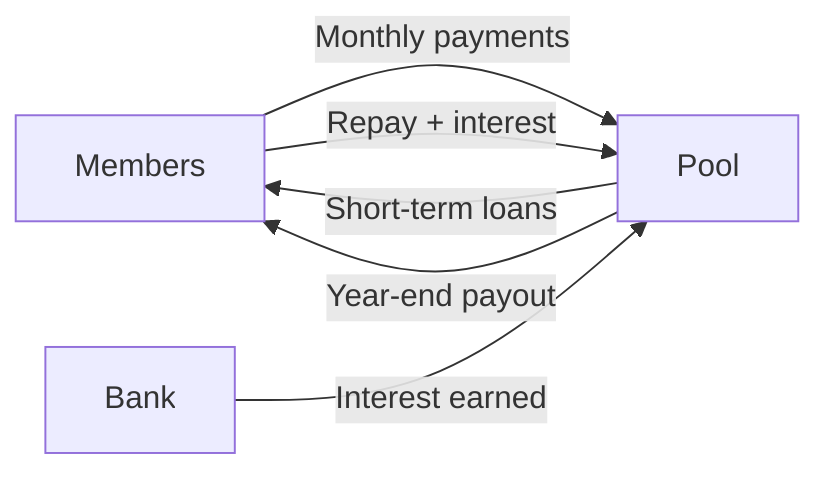

# Overview

Vault Vibes is a digital platform for managing a **stokvel** — a South African community savings group where members pool money, earn returns, and access short-term loans.

## What it does

Members contribute monthly. Their money goes into a shared pool. The pool grows through contributions, loan interest, and bank interest. At year-end, each member's share of the pool is calculated and distributed.



## Core concepts

| Concept | What it means |
|---|---|
| Share | A unit of ownership in the pool. More shares = bigger slice of the pie. |
| Contribution | A monthly payment. Amount = shares × share price. |
| Pool | All the money: cash in the bank + money lent out. |
| Loan | Short-term borrowing against your share value. Repaid with interest. |
| Ledger | The single source of truth for every rand that moves in or out. |
| Distribution | Year-end payout to each member based on their share value. |

## Key formulas

```
Pool Value   = Bank Balance + Outstanding Loans
Share Value  = Pool Value ÷ Total Funded Shares
Member Value = Shares Owned × Share Value
Profit       = Member Value − Contributions Paid
Interest     = Principal × (Rate ÷ 100)
```

## Roles

| Role | Can do |
|---|---|
| Member | View pool, contribute, request loans |
| Treasurer | Everything a member can + verify contributions, issue loans, invite members, manage shares |
| Chairperson | Same as Treasurer |
| Admin | Everything |

## Tech stack

Java 21, Spring Boot 3.3, PostgreSQL, AWS (Cognito, S3, ECS Fargate, EventBridge, Lambda), Flyway migrations, Swagger/OpenAPI docs.
