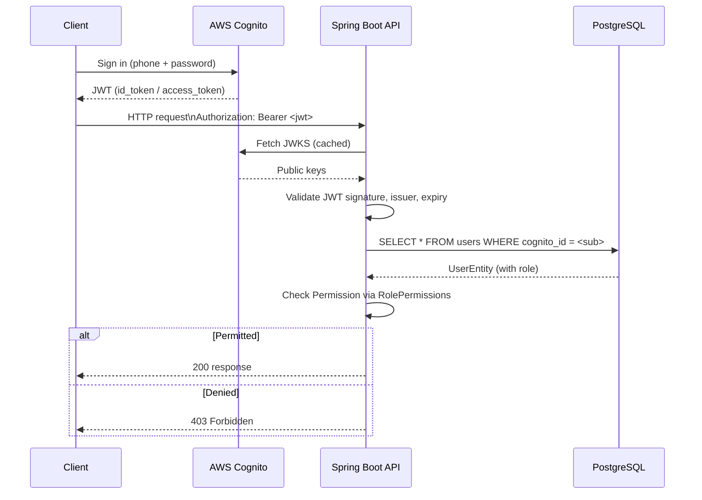
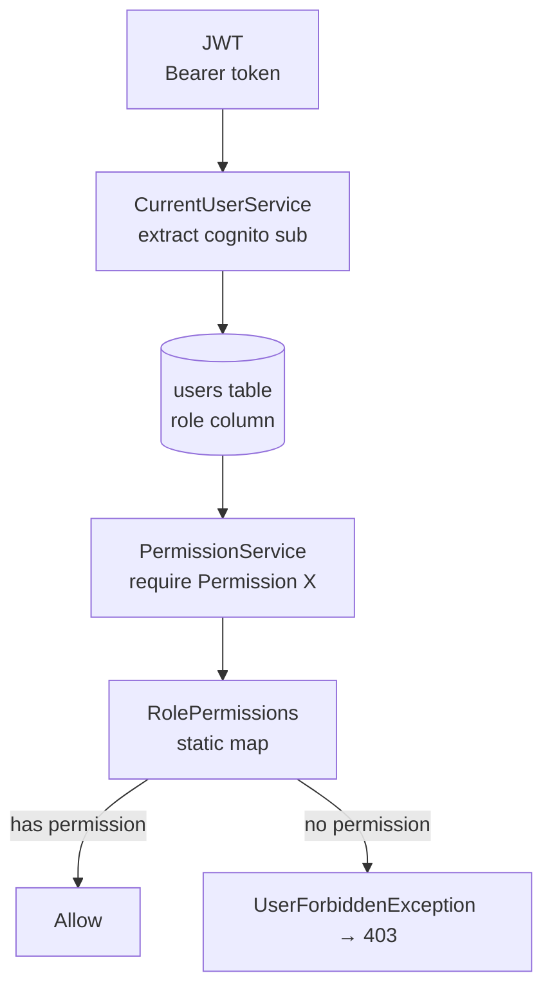

# Security

## Authentication Flow



## JWT Validation

Spring Security is configured as an **OAuth2 Resource Server**. On every request to `/api/**`:

1. The `Authorization: Bearer` header is extracted.
2. The JWT is validated against the Cognito JWKS endpoint (`https://cognito-idp.us-east-1.amazonaws.com/us-east-1_Pmg4WjBdm/.well-known/jwks.json`).
3. Signature, issuer URI, and expiry are all verified.
4. The `cognito:groups` claim is mapped to Spring `GrantedAuthority` objects with the `ROLE_` prefix.

Configuration in `SecurityConfig.java`:

```java
.oauth2ResourceServer(oauth2 -> oauth2
    .jwt(jwt -> jwt.jwtAuthenticationConverter(jwtAuthenticationConverter()))
);
```

The JWT `sub` claim is the Cognito user UUID. It is used in `CurrentUserService` to look up the application-level `UserEntity` in the database.

## Role and Permission Model



Roles (stored in the `users.role` column):

| Role | Permission set |
|---|---|
| `MEMBER` | `VIEW_POOL`, `VIEW_LEDGER`, `CONTRIBUTE`, `REQUEST_LOAN` |
| `TREASURER` | All MEMBER permissions + `VERIFY_CONTRIBUTION`, `ISSUE_LOAN`, `RECORD_REPAYMENT`, `RECORD_BANK_INTEREST`, `INVITE_MEMBER`, `MANAGE_SHARES`, `VIEW_FINANCIAL_REPORTS`, `AUDIT_LEDGER` |
| `CHAIRPERSON` | Same as `TREASURER` |
| `ADMIN` | All permissions including `SYSTEM_ADMIN` |

The role is read from the database on every request, so role changes take effect immediately without requiring token re-issuance.

## Proof-of-Payment Access Control

Proof-of-payment files are stored in a **private S3 bucket**. Access is never granted via a public URL. Instead:

1. The `ProofSignedUrlService` generates a pre-signed S3 URL scoped to the specific object.
2. The URL has a short expiry (configurable, see `ProofSignedUrlService.EXPIRY_MINUTES`).
3. Access is restricted in `ContributionController`:
   - A member may only retrieve a signed URL for their **own** contribution's proof.
   - An admin (TREASURER / CHAIRPERSON / ADMIN) may access any proof via `VERIFY_CONTRIBUTION` permission.

## CORS Policy

CORS is configured in `CorsConfig.java`:

| Setting | Value |
|---|---|
| Allowed origins | `http://localhost:5173`, `http://localhost:3000` |
| Allowed methods | `GET`, `POST`, `PUT`, `PATCH`, `DELETE`, `OPTIONS` |
| Allowed headers | `*` |
| Exposed headers | `Authorization` |
| Allow credentials | `true` |

For production, update the allowed origins to include the deployed frontend domain.

## Session Management

The API is **stateless**. `SessionCreationPolicy.STATELESS` is set in `SecurityConfig`. No cookies or server-side sessions are used.

## CSRF

CSRF protection is disabled (`AbstractHttpConfigurer::disable`) because the API is stateless and JWT-authenticated. CSRF is only relevant for cookie-based session authentication.

## File Upload Limits

Configured in `application.yml`:

```yaml
spring:
  servlet:
    multipart:
      max-file-size: 5MB
      max-request-size: 10MB
```

Uploaded proof files (PDF, JPG, JPEG, PNG) are validated for file type in `S3UploadService` before being stored.

## Actuator Exposure

Only `health` and `info` endpoints are exposed via the Actuator:

```yaml
management:
  endpoints:
    web:
      exposure:
        include: health,info
```

These are permitted without authentication.
